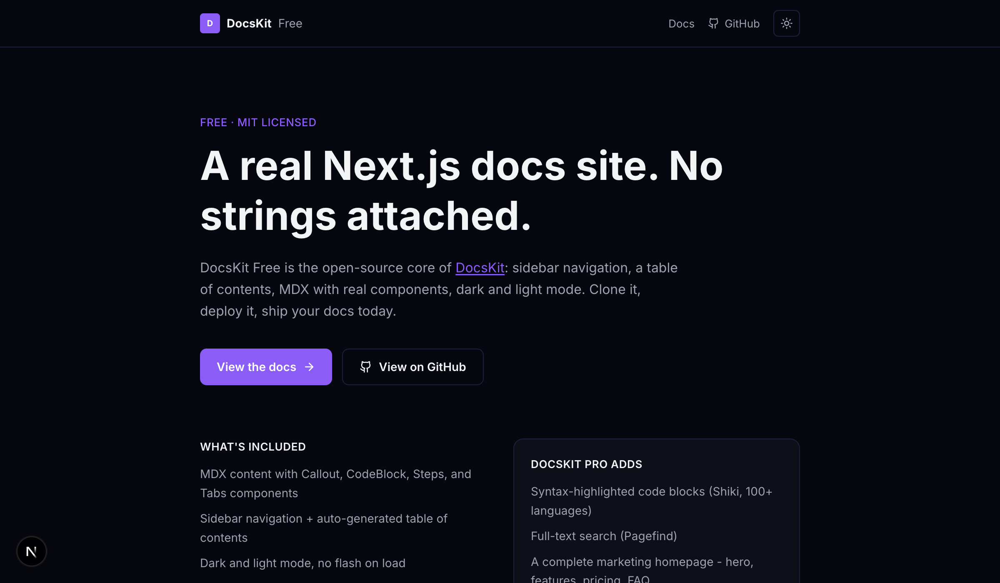

# DocsKit Free

The open-source core of [DocsKit](https://thekitbase.app/templates/docskit) - a Next.js documentation site template. This is the free, MIT-licensed version: a working docs site with real MDX components, dark/light mode, and a sidebar + table-of-contents layout. Not a crippled demo - genuinely usable as-is.



**[Live demo](https://docskit-free.vercel.app/)** &middot; [Deploy your own](https://vercel.com/new/clone?repository-url=https%3A%2F%2Fgithub.com%2Fthekitbase%2Fdocskit-free&project-name=docskit-free&repository-name=docskit-free)

[](https://vercel.com/new/clone?repository-url=https%3A%2F%2Fgithub.com%2Fthekitbase%2Fdocskit-free&project-name=docskit-free&repository-name=docskit-free)
[](./LICENSE)

## What's in the free version

- MDX content with `Callout`, `CodeBlock`, `Steps`, and `Tabs` components
- Sidebar navigation + auto-generated table of contents
- Dark and light mode, no flash on load
- Static export - deploy to Vercel, Netlify, Cloudflare Pages, or any static host
- TypeScript strict, no YAML/JSON config to manage

## What's in [DocsKit Pro](https://thekitbase.app/templates/docskit?utm_source=docskit-free&utm_medium=readme&utm_campaign=docskit) ($39, one-time)

The parts that take real time to get right:

- **Syntax-highlighted code blocks** - Shiki, 100+ languages, filename tabs
- **Full-text search** - Pagefind, indexed at build time, zero server cost
- **A complete marketing homepage** - hero, features, pricing, FAQ, testimonials
- **Configuration and API reference doc sections**
- Ongoing updates

Comparing this repo against the Pro version is the fastest way to see exactly what's different - nothing here is obfuscated or intentionally broken to force an upgrade.

## Quick start

```bash
git clone https://github.com/thekitbase/docskit-free.git my-docs
cd my-docs
npm install
npm run dev
```

Open [http://localhost:3000](http://localhost:3000) (or whichever port your terminal shows). The homepage is at `/`, docs at `/docs`.

Full setup, deployment, and customization guide: run the dev server and visit `/docs`, or read the MDX source directly in [`content/docs/`](./content/docs).

## Tech stack

Next.js 16 (App Router, static export) · React 19 · TypeScript strict · Tailwind CSS v4 · MDX via `next-mdx-remote`

## License

MIT - see [LICENSE](./LICENSE). Use it for anything, commercial or personal, no attribution required (though a link back is always appreciated).
